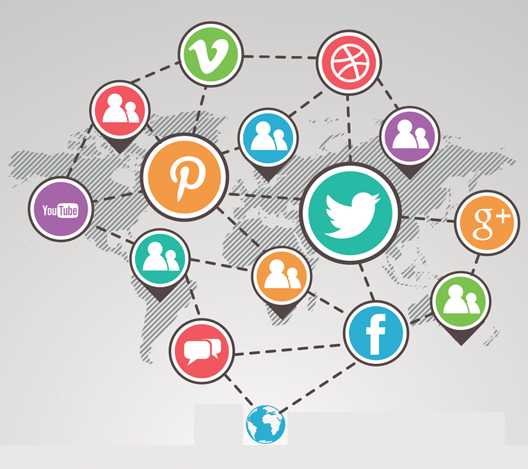

# Test1

# Social Networking Sites 

A social networking service is an online platform that people use to build social networks or social relationships with other people who share similar personal or career interests, activities, backgrounds or real-life connections.

Social networking sites play a crucial role in modern communication, marketing, and community building. Each platform offers unique features and caters to different audiences, making them valuable tools for personal and professional use. 

Social media platforms continue to evolve, catering to various user needs and preferences. Whether for personal use, marketing, or community engagement, there is a platform suited for every purpose. Understanding the unique features and demographics of each site can help users choose the right platforms for their goals..G

## Data

There exists many types of social networking platforms, each having diffrent focuses. Table illustrates a few examples within diffrent content groups.

| name  | type | content/ focus |
|------| ------| ------ |
| 4chan | imageboard | Anime, manga, video games etc. |
| Github | social coding | software development |
| Tumblr | blog | microblogging |
| Discord | communication | Live chat and voice for groups |

